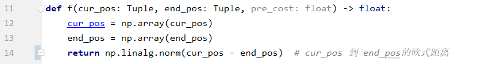

# 高级人工智能第一次作业

- 学号: SA21011130 
- 姓名: 黄锦涛

[toc]

## 问题描述

- 路径规划问题。求一个人从开始点到结束点的路径或最短路径，并求出此路径的距离。其中网格边长为1，对角线距离为 $\sqrt{2} $
- 例如: 下图的例子。蓝点为开始点，红点为结束点，黑色部分为墙体。

## 问题的形式化

与搜索5要素一一对应：

- 状态空间：人所在地图的某一位置(x, y)对应一个状态。所有位置或状态的总和即为状态空间。上述例子的地图宽高为(20, 10)，状态空间数共200个。
- 后继函数：人从某一点合法的（即不越界，不入墙体）往上下左右或左上、左下、右上、右下走一步，共八个方向，得到另一种状态。
- 初始状态：人从开始点出发。
- 目标状态：人到达结束点。
- 路径耗散：直着走路径耗散是1，斜着对角线走路径耗散是$ \sqrt{2} $。

## 问题的求解与分析

- 代码网址: [https://github.com/Jintao-Huang/course_homework/tree/main/gaoren/hw0](https://github.com/Jintao-Huang/course_homework/tree/main/gaoren/hw0)
- 核心代码如下，并给出三种解决方案。下面的三种解决方案使用了相同的核心代码，但使用了不同的启发式函数。
- 接口含义：
  1. env_matrix为环境矩阵，每个点分别对应5种状态：START、END、BG、WALL、VISITED。env_matrix的shape为(H, W)即(10, 20)。
  2. f为启发式函数。传入该人的当前位置，结束位置和从出发点走到当前位置的路径耗散。返回该点的评估值。
  3. 函数返回：若找到路径，函数返回一个元组，包含路径或最短路径，以及该路径的距离。若没有找到路径则返回None。

### 1 代价一致搜索

- 核心代码见上，启发式函数如下。代价一致搜索可以得到最优解，但搜索速度最慢。

- 时间复杂度：访问过的节点数目（见下图黄色区域），空间复杂度：同时保存在内存中节点数目的最大值。
- 运行效果，其中黄色部分为搜索的范围，红线则为找到的最短路径。并打印了路径的距离(cost)和路径(path)每一点位置（x, y），其中左上角为(0, 0)点。

### 2 贪心算法

- 核心代码见上，启发式函数如下。贪心算法可以得到解，但不是最优解，但搜索速度最快。

- 时间复杂度：访问过的节点数目（见下图黄色区域），空间复杂度：同时保存在内存中节点数目的最大值。
- 运行效果，其中黄色部分为搜索的范围，红线则为找到的路径。并打印了路径的距离(cost)和路径(path)每一点位置（x, y），其中左上角为(0, 0)点。比较该算法与代价一致搜索的路径距离要长，可得，贪心算法不一定得到最优解。

### 3 A\*算法

- 核心代码见上，启发式函数为，使用欧几里得距离。A\*算法可以得到最优解，搜索速度适中。

- 时间复杂度：访问过的节点数目（见下图黄色区域），空间复杂度：同时保存在内存中节点数目的最大值。
- 运行效果，其中黄色部分为搜索的范围，红线则为找到的最短路径。并打印了路径的距离(cost)和路径(path)每一点位置（x, y），其中左上角为(0, 0)点。

